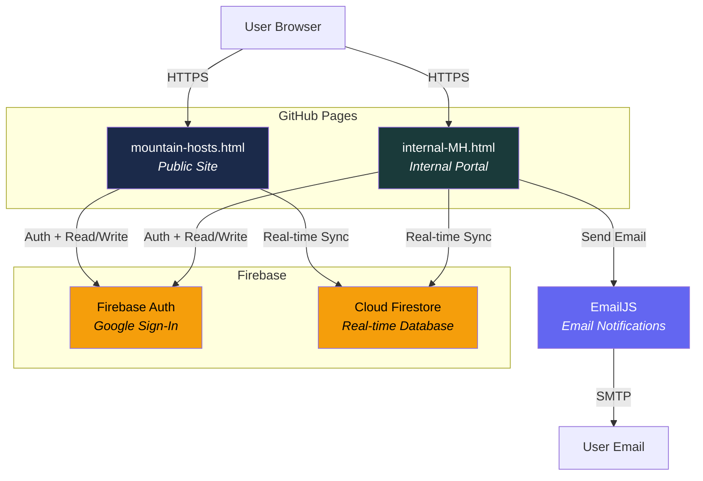
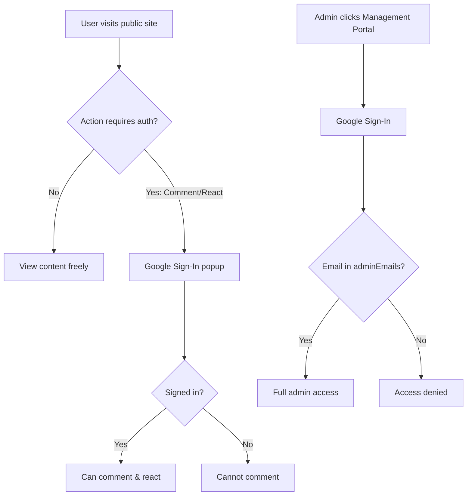
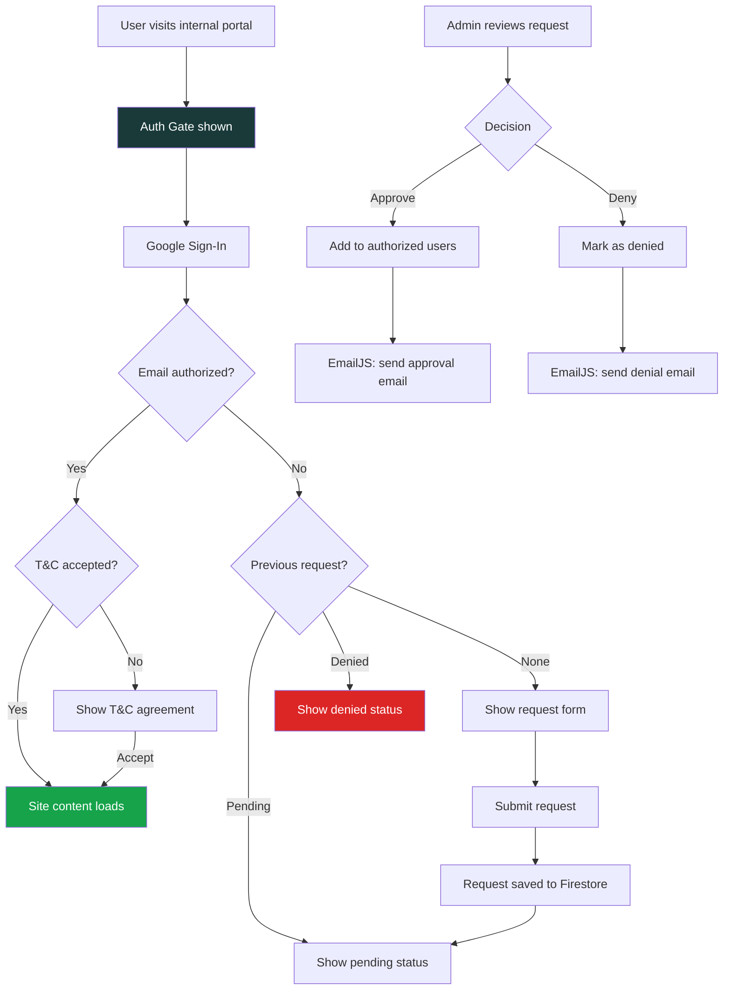
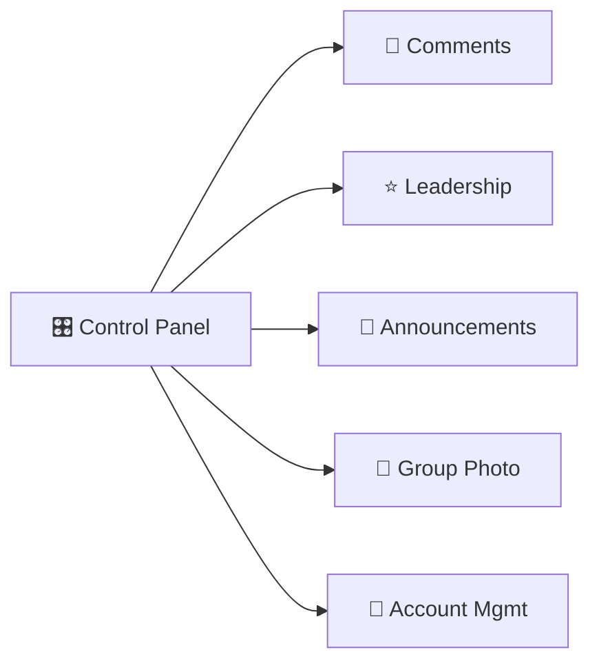
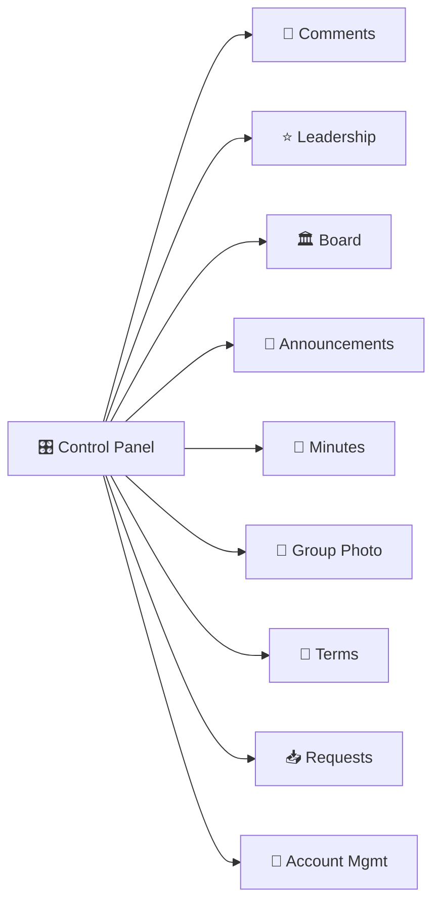
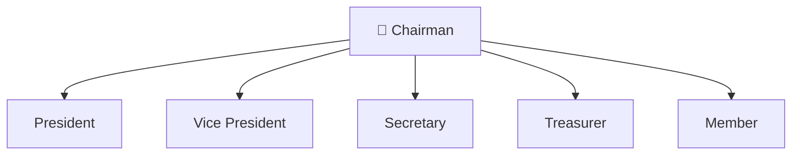
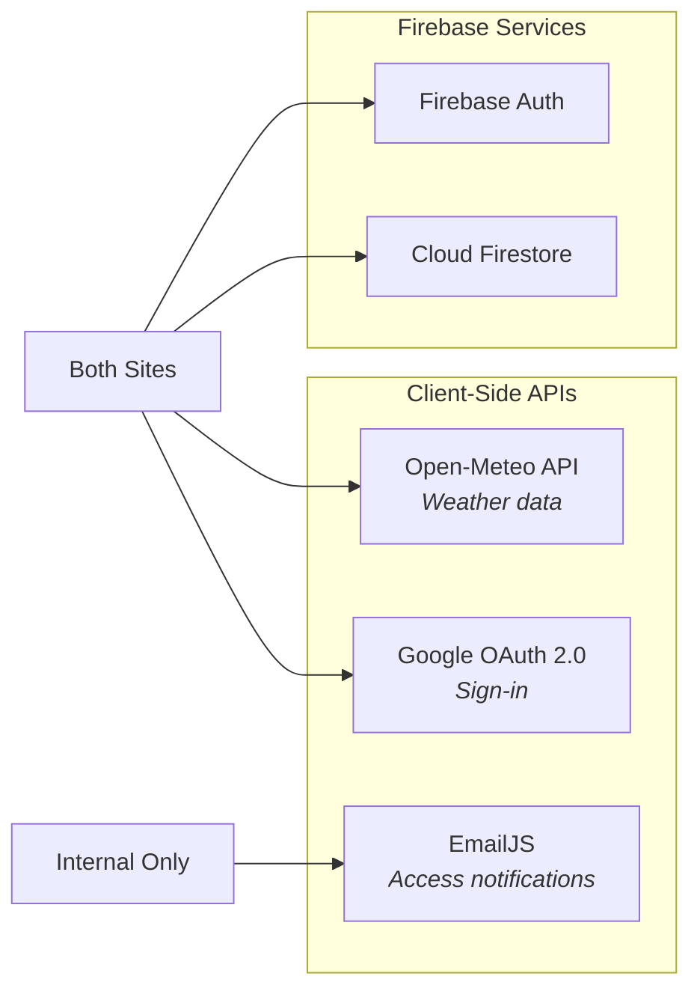

# Bogus Basin Mountain Hosts — Architecture

## System Overview

The project consists of two single-page HTML applications hosted on GitHub Pages, backed by Firebase (Auth + Firestore) and EmailJS for notifications. There is no custom backend — everything runs client-side.



---

## Hosting & Deployment

| Component | Service | URL |
|-----------|---------|-----|
| Public Site | GitHub Pages | `https://mountainstogo.github.io/bbhosts/mountain-hosts.html` |
| Internal Portal | GitHub Pages | `https://mountainstogo.github.io/bbhosts/internal-MH.html` |
| Repository | GitHub | `https://github.com/MountainsToGo/bbhosts` |
| Database & Auth | Firebase | *(project ID in source)* |
| Email Notifications | EmailJS | *(service ID in source)* |
| Firestore Rules | Firebase Console | Deployed manually |

---

## File Structure

```
BBHost/
├── mountain-hosts.html       # Public-facing site (single HTML file)
├── internal-MH.html          # Internal portal (single HTML file)
├── firestore.rules           # Firestore security rules (deploy via Firebase Console)
├── README.md                 # Public site documentation
├── README-internal.md        # Internal portal documentation
├── INSTRUCTIONS.md           # Public site admin guide
├── INSTRUCTIONS-internal.md  # Internal portal admin guide
└── ARCHITECTURE.md           # This file
```

---

## Authentication Flow

### Public Site


### Internal Portal


---

## Firestore Data Model

```mermaid
erDiagram
    PUBLIC_COMMENTS {
        string id PK
        string text
        string userName
        string userEmail
        string userPhoto
        timestamp createdAt
        map reactions
        array replies
    }

    PUBLIC_LEADERS {
        string id PK
        string name
        string role
        string photo
        string bio
    }

    PUBLIC_ANNOUNCEMENTS {
        string id PK
        string type
        string title
        string content
        timestamp createdAt
    }

    PUBLIC_SETTINGS {
        string site "groupPhoto URL"
        string adminEmails "authorized admin list"
    }

    INTERNAL_COMMENTS {
        string id PK
        string text
        string userName
        string userEmail
        string userPhoto
        timestamp createdAt
        map reactions
        array replies
    }

    INTERNAL_LEADERS {
        string id PK
        string name
        string role
        string photo
        string bio
    }

    INTERNAL_DIRECTORS {
        string id PK
        string name
        string role
        string photo
    }

    INTERNAL_ANNOUNCEMENTS {
        string id PK
        string type
        string title
        string content
        timestamp createdAt
    }

    INTERNAL_MINUTES {
        string id PK
        string title
        string date
        string content
        timestamp createdAt
    }

    INTERNAL_SETTINGS {
        string site "groupPhoto, siteDescription"
        string adminEmails "admin email list"
        string authorizedUsers "authorized user list"
        string termsAndConditions "T&C HTML content"
    }

    INTERNAL_TC_AGREEMENTS {
        string id PK
        string email
        timestamp agreedAt
        string version
    }

    INTERNAL_ACCESS_REQUESTS {
        string id PK
        string email
        string name
        string reason
        string status
        string reviewedBy
        timestamp requestedAt
        timestamp reviewedAt
    }
```



---

## Firestore Collections Map

### Public Site Collections
| Collection | Purpose | Read | Write |
|------------|---------|------|-------|
| `comments` | Guest comments with reactions | Public | Authenticated |
| `leaders` | Leadership directory | Public | Admin |
| `announcements` | News & awards | Public | Admin |
| `settings/site` | Group photo, site config | Public | Admin |
| `settings/adminEmails` | Admin email whitelist | Public | Admin |

### Internal Portal Collections
| Collection | Purpose | Read | Write |
|------------|---------|------|-------|
| `internal_comments` | Host discussion board | Authenticated | Authenticated |
| `internal_leaders` | Internal leadership | Authenticated | Admin |
| `internal_directors` | Board of Directors | Authenticated | Admin |
| `internal_announcements` | Internal announcements | Authenticated | Admin |
| `internal_minutes` | Meeting minutes | Authenticated | Admin |
| `internal_settings/site` | Site config, group photo | Public* | Admin |
| `internal_settings/adminEmails` | Admin whitelist | Public* | Admin |
| `internal_settings/authorizedUsers` | Authorized user list | Public* | Admin |
| `internal_settings/termsAndConditions` | T&C content & version | Public* | Admin |
| `internal_tc_agreements` | User T&C acceptances | Authenticated | Authenticated |
| `internal_access_requests` | Access request records | Authenticated | Authenticated |

_*Public read required for auth gate to verify user authorization before full sign-in._

---

## Admin Management Portal

Both sites use an icon-grid control panel for admin functions.

### Public Site — 5 Panels


### Internal Portal — 9 Panels


---

## Board of Directors Hierarchy



---

## External Integrations



| Service | Purpose | Auth/Key |
|---------|---------|----------|
| Firebase Auth | Google sign-in provider | Config in source (client-side) |
| Cloud Firestore | Real-time data storage | Config in source (client-side) |
| Open-Meteo API | Weather conditions for banner | None (public API) |
| EmailJS | Access request notifications | Key in source (client-side) |

---

## Security Model

| Layer | Public Site | Internal Portal |
|-------|-------------|-----------------|
| **Viewing** | No auth required | Auth gate (Google sign-in + authorized email list) |
| **Commenting** | Google sign-in required | Google sign-in required (auto via auth gate) |
| **Admin Access** | Email in `settings/adminEmails` | Email in `internal_settings/adminEmails` |
| **Data Isolation** | `comments`, `leaders`, etc. | `internal_*` prefixed collections |
| **T&C Gating** | None | Must accept T&C on first visit |
| **Access Requests** | N/A | Unauthorized users can request access |
| **Firestore Rules** | Public read, auth write | Auth required for read & write |

---

## Color Schemes

| Element | Public Site | Internal Portal |
|---------|-------------|-----------------|
| Primary | Navy `#1b2a4a` | Teal `#1a3a3a` |
| Accent | Gold `#c8913a` | Copper `#b5651d` |
| Theme | Winter mountain | Forest/alpine |

---

## Technology Stack

- **Frontend:** Vanilla HTML/CSS/JavaScript (no frameworks)
- **Hosting:** GitHub Pages (static)
- **Auth:** Firebase Auth with Google provider
- **Database:** Cloud Firestore (real-time listeners via `onSnapshot`)
- **Email:** EmailJS (client-side, free tier — 200/month)
- **Weather:** Open-Meteo API (no key required)
- **SDK Versions:** Firebase compat v10.12.0, EmailJS browser v4
