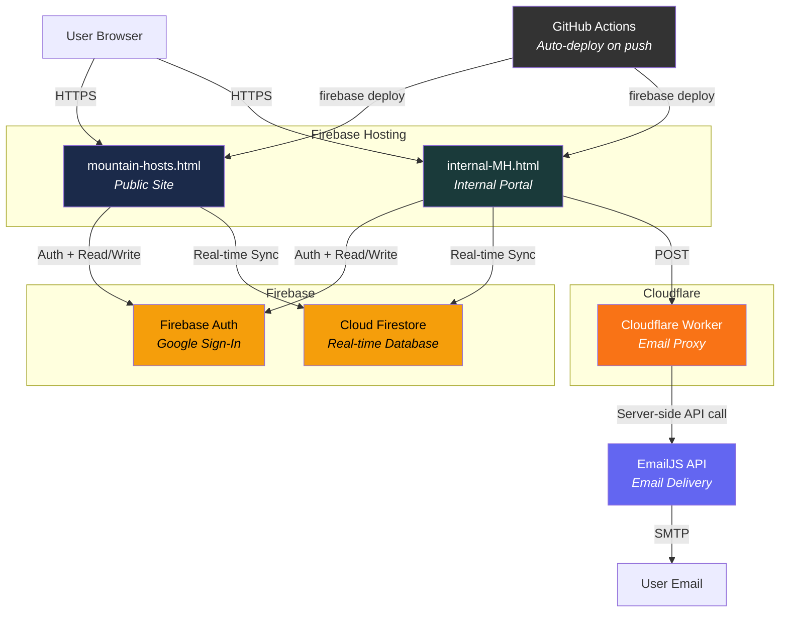
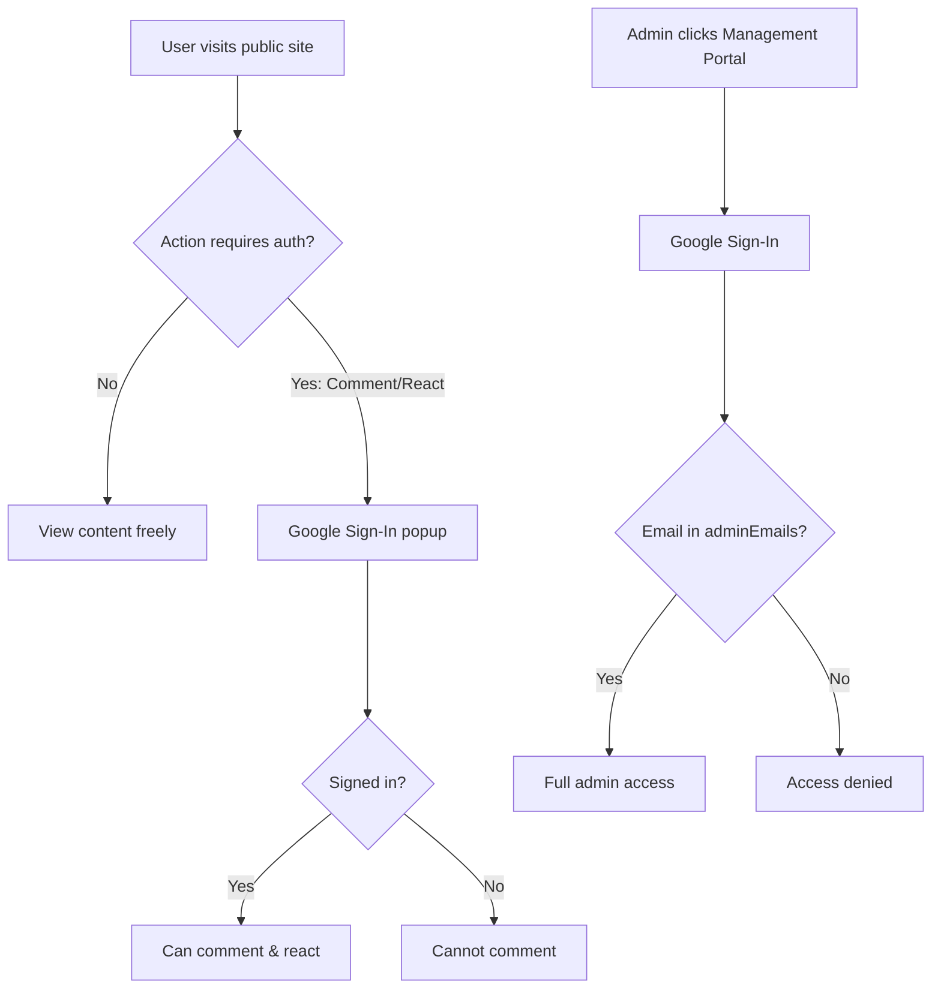
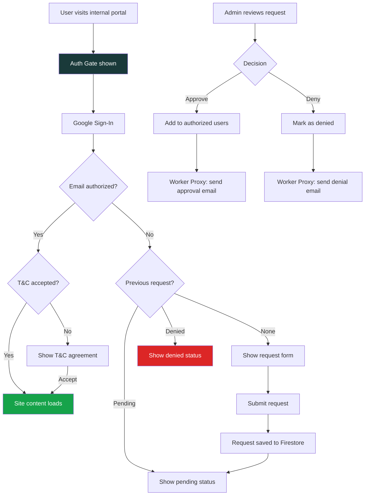
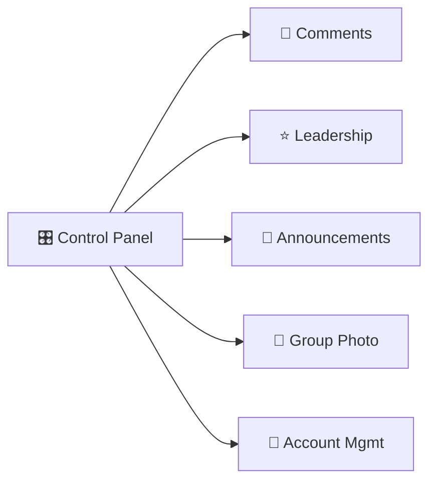
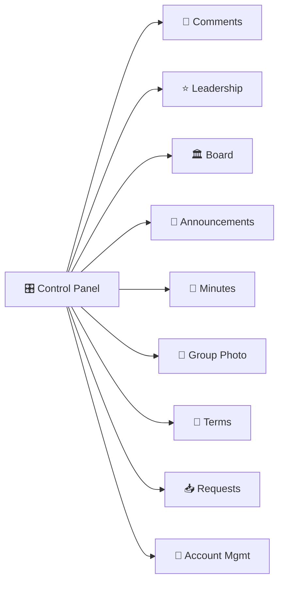
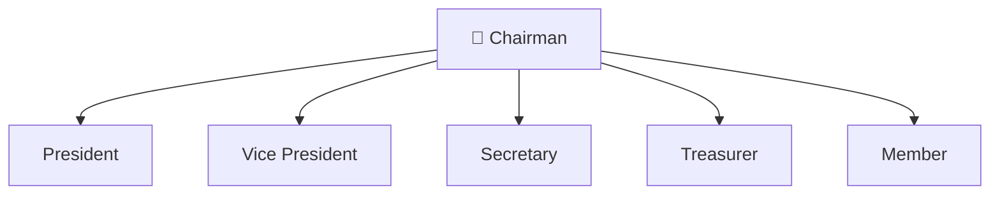
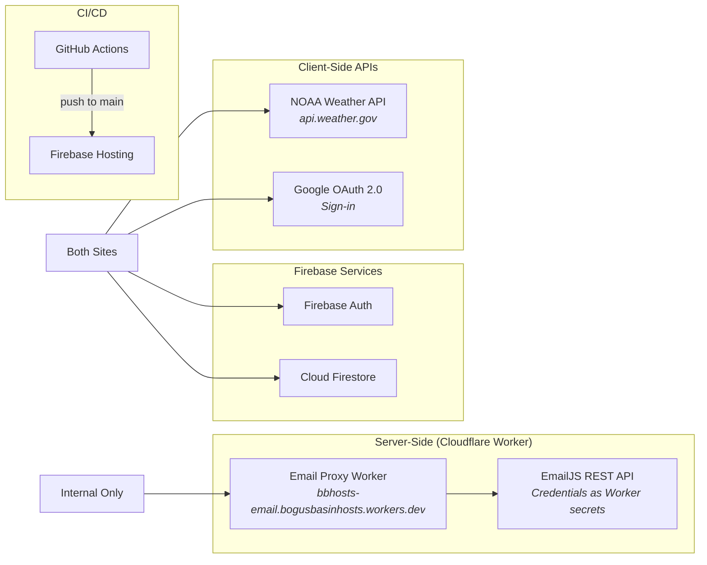

# Bogus Basin Mountain Hosts — Architecture

## System Overview

The project consists of two single-page HTML applications hosted on Firebase Hosting, backed by Firebase (Auth + Firestore), a Cloudflare Worker for secure email proxying, and GitHub Actions for CI/CD. There is no traditional backend server — security is enforced via Firestore rules and the Cloudflare Worker.



---

## Hosting & Deployment

| Component | Service | URL / Location |
|-----------|---------|----------------|
| Public Site | Firebase Hosting | `https://mtn-hosts.web.app/mountain-hosts.html` |
| Internal Portal | Firebase Hosting | `https://mtn-hosts.web.app/internal-MH.html` |
| GitHub Pages (mirror) | GitHub Pages | `https://mountainstogo.github.io/bbhosts/` |
| Repository | GitHub | `https://github.com/MountainsToGo/bbhosts` |
| Database & Auth | Firebase | Project: `mtn-hosts` |
| Email Proxy | Cloudflare Workers | `https://bbhosts-email.bogusbasinhosts.workers.dev` |
| Email Delivery | EmailJS | Credentials stored as Cloudflare Worker secrets |
| Firestore Rules | Firebase | Deployed via CLI (`firebase deploy --only firestore:rules`) |
| CI/CD | GitHub Actions | Auto-deploys to Firebase on push to `main` |

---

## File Structure

```
BBHost/
├── mountain-hosts.html                     # Public-facing site (single HTML file)
├── internal-MH.html                        # Internal portal (single HTML file)
├── firestore.rules                         # Firestore security rules (deployed via CLI)
├── firebase.json                           # Firebase Hosting + Firestore config
├── .firebaserc                             # Firebase project link (mtn-hosts)
├── .gitignore                              # Excludes .firebase/, .wrangler/, .env, etc.
├── email-worker/                           # Cloudflare Worker (EmailJS proxy)
│   ├── worker.js                           # Worker source — CORS + origin check + EmailJS relay
│   └── wrangler.toml                       # Wrangler config (secrets via `wrangler secret put`)
├── .github/workflows/
│   └── firebase-hosting-merge.yml          # GitHub Actions: auto-deploy on push to main
├── README.md                               # Public site documentation
├── README-internal.md                      # Internal portal documentation
├── INSTRUCTIONS.md                         # Public site admin guide
├── INSTRUCTIONS-internal.md                # Internal portal admin guide
└── ARCHITECTURE.md                         # This file
```

---

## Authentication Flow

### Public Site


### Internal Portal


---

## Firestore Data Model

```mermaid
erDiagram
    PUBLIC_COMMENTS {
        string id PK
        string text
        string userName
        string userEmail
        string userPhoto
        timestamp createdAt
        map reactions
        array replies
    }

    PUBLIC_LEADERS {
        string id PK
        string name
        string role
        string photo
        string bio
    }

    PUBLIC_ANNOUNCEMENTS {
        string id PK
        string type
        string title
        string content
        timestamp createdAt
    }

    PUBLIC_SETTINGS {
        string site "groupPhoto URL"
        string adminEmails "authorized admin list"
    }

    INTERNAL_COMMENTS {
        string id PK
        string text
        string userName
        string userEmail
        string userPhoto
        timestamp createdAt
        map reactions
        array replies
    }

    INTERNAL_LEADERS {
        string id PK
        string name
        string role
        string photo
        string bio
    }

    INTERNAL_DIRECTORS {
        string id PK
        string name
        string role
        string photo
    }

    INTERNAL_ANNOUNCEMENTS {
        string id PK
        string type
        string title
        string content
        timestamp createdAt
    }

    INTERNAL_MINUTES {
        string id PK
        string title
        string date
        string content
        timestamp createdAt
    }

    INTERNAL_SETTINGS {
        string site "groupPhoto, siteDescription"
        string adminEmails "admin email list"
        string authorizedUsers "authorized user list"
        string termsAndConditions "T&C HTML content"
    }

    INTERNAL_TC_AGREEMENTS {
        string id PK
        string email
        timestamp agreedAt
        string version
    }

    INTERNAL_ACCESS_REQUESTS {
        string id PK
        string email
        string name
        string reason
        string status
        string reviewedBy
        timestamp requestedAt
        timestamp reviewedAt
    }
```



---

## Firestore Collections Map

### Public Site Collections
| Collection | Purpose | Read | Write |
|------------|---------|------|-------|
| `comments` | Guest comments with reactions | Public | Authenticated |
| `leaders` | Leadership directory | Public | Admin |
| `announcements` | News & awards | Public | Admin |
| `settings/site` | Group photo, site config | Public | Admin |
| `settings/adminEmails` | Admin email whitelist | Public | Admin |

### Internal Portal Collections
| Collection | Purpose | Read | Write |
|------------|---------|------|-------|
| `internal_comments` | Host discussion board | Authenticated | Authenticated |
| `internal_leaders` | Internal leadership | Authenticated | Admin |
| `internal_directors` | Board of Directors | Authenticated | Admin |
| `internal_announcements` | Internal announcements | Authenticated | Admin |
| `internal_minutes` | Meeting minutes | Authenticated | Admin |
| `internal_settings/site` | Site config, group photo | Public* | Admin |
| `internal_settings/adminEmails` | Admin whitelist | Public* | Admin |
| `internal_settings/authorizedUsers` | Authorized user list | Public* | Admin |
| `internal_settings/termsAndConditions` | T&C content & version | Public* | Admin |
| `internal_tc_agreements` | User T&C acceptances | Authenticated | Authenticated |
| `internal_access_requests` | Access request records | Authenticated | Authenticated |

_*Public read required for auth gate to verify user authorization before full sign-in._

---

## Admin Management Portal

Both sites use an icon-grid control panel for admin functions.

### Public Site — 5 Panels


### Internal Portal — 9 Panels


---

## Board of Directors Hierarchy



---

## External Integrations



| Service | Purpose | Auth / Credentials |
|---------|---------|--------------------|
| Firebase Auth | Google sign-in provider | Config in source (client-side, public by design) |
| Cloud Firestore | Real-time data storage | Config in source (secured by Firestore rules) |
| NOAA Weather API | Weather conditions for banner | None (public API) |
| Cloudflare Worker | Email proxy — CORS-locked | Worker URL in source (CORS-protected) |
| EmailJS | Email delivery | Secrets in Cloudflare Worker (never in browser) |
| GitHub Actions | Auto-deploy on push | Firebase CI token in GitHub Secrets |

---

## Security Model

| Layer | Public Site | Internal Portal |
|-------|-------------|-----------------|
| **Hosting** | Firebase Hosting (`mtn-hosts.web.app`) | Firebase Hosting (`mtn-hosts.web.app`) |
| **Viewing** | No auth required | Auth gate (Google sign-in + authorized email list) |
| **Commenting** | Google sign-in required | Google sign-in required (auto via auth gate) |
| **Comment Updates** | Reactions-only (server-enforced) | Reactions-only (server-enforced) |
| **Admin Access** | Email in `settings/adminEmails` (server-verified) | Email in `internal_settings/adminEmails` (server-verified) |
| **Data Isolation** | `comments`, `leaders`, etc. | `internal_*` prefixed collections |
| **T&C Gating** | None | Must accept T&C on first visit |
| **Access Requests** | N/A | Unauthorized users can request access |
| **Email Notifications** | None | Via Cloudflare Worker proxy (server-side credentials) |
| **XSS Protection** | DOMPurify v3 sanitizes all user HTML | DOMPurify v3 sanitizes all user HTML |
| **Firestore Rules** | Public read, admin-only write (server-enforced) | Auth required for read, admin-only write (server-enforced) |
| **CI/CD** | GitHub Actions → Firebase Hosting | GitHub Actions → Firebase Hosting |
| **Secrets Management** | Firebase config (public by design) | EmailJS creds in Cloudflare Worker secrets |

### Firestore Rules Security
- Admin status verified **server-side** via `isPublicAdmin()` / `isInternalAdmin()` helper functions
- These check `request.auth.token.email` against the `adminEmails` Firestore document
- Bootstrap protection: `!exists()` fallback allows first admin to self-seed
- Comment updates restricted to `reactions` field only via `affectedKeys().hasOnly(['reactions'])`
- T&C agreements restricted to user's own document
- Access request approval/denial restricted to admins only

### Email Security (Cloudflare Worker Proxy)
- EmailJS credentials (service ID, template ID, public key, private key) stored as **encrypted Cloudflare Worker secrets**
- Zero credentials in browser-side code
- Worker enforces **CORS origin allowlist**: `mtn-hosts.web.app`, `mountainstogo.github.io`, `localhost`
- Worker validates required fields before forwarding to EmailJS API
- Free tier: 100,000 Worker requests/day, 200 EmailJS emails/month

---

## Color Schemes

| Element | Public Site | Internal Portal |
|---------|-------------|-----------------|
| Primary | Navy `#1b2a4a` | Teal `#1a3a3a` |
| Accent | Gold `#c8913a` | Copper `#b5651d` |
| Theme | Winter mountain | Forest/alpine |

---

## Technology Stack

- **Frontend:** Vanilla HTML/CSS/JavaScript (no frameworks)
- **Hosting:** Firebase Hosting (primary), GitHub Pages (mirror)
- **Auth:** Firebase Auth with Google provider
- **Database:** Cloud Firestore (real-time listeners via `onSnapshot`)
- **Email Proxy:** Cloudflare Workers (server-side credential storage)
- **Email Delivery:** EmailJS (via Cloudflare Worker proxy — 200/month free tier)
- **XSS Protection:** DOMPurify v3 (CDN)
- **Weather:** NOAA Weather API (api.weather.gov, no key required)
- **CI/CD:** GitHub Actions (auto-deploy to Firebase on push to `main`)
- **SDK Versions:** Firebase compat v10.12.0, DOMPurify v3, Wrangler v4
